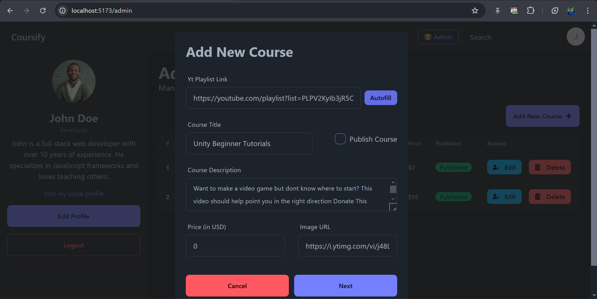

<div align="center">
    
    <h1>Coursify - AI Powered Course Website</h1>
</div>

Coursify is a comprehensive course marketplace built with ReactJS, Node.js, and Express. Users can explore, purchase, and view courses, while admins have full control to create, manage, and publish course content. The platform leverages AI for streamlined content creation, providing an efficient and engaging experience for both students and administrators.

## Table of Contents

1. [Features](#features)
   - [User Features](#user-features)
   - [Admin Features](#admin-features)
2. [Tech Stack](#tech-stack)
3. [Preview Images](#preview-images)
4. [Installation](#installation)
5. [Usage](#usage)

---

## Features

### User Features

- **User Authentication**: Users can register and sign in with their email and password.
- **Browse Courses**: View all available courses, each with a detailed overview (instructor info, duration, difficulty level).
- **Enroll in Courses**: Users can enroll in courses and access them via the "My Courses" section.
- **Course Playback**: Watch purchased course videos on a dedicated course video page.
- **Search and Filter**: Search for courses by keyword; filter results by difficulty level, duration, and more.
- **Responsive Design**: Mobile-friendly design for seamless viewing on any device.
- **PWA Support**: Coursify supports PWA (Progressive Web App) development.

### Admin Features

- **Admin Authentication**: Admins have a separate registration and login system.
- **Dashboard**: View personal details, manage profile, and see listed courses.
- **Course Management**: Admins can add, edit, or delete courses.
- **AI-Powered Course Generation**: Gemini AI automatically fills course content (overview, requirements, others) based on a provided YouTube playlist.
- **Detailed Course Publishing**: Specify course title, description, image, price, and other details, with AI-generated suggestions.
- **Course Listing**: Successfully published courses appear on the homepage and in users' dashboards.

## Tech Stack

- **Frontend**: ReactJS, React Router, React Query, TailwindCSS, DaisyUI, React Error Boundary, Axios, React Icons,
- **Backend**: Node.js, Express.js, Mongoose
- **Authentication**: JWT, bcrypt
- **AI Integration**: Gemini AI
- **Validation**: Zod

## Preview Images

### User Previews

#### Home Page


#### Course Deatils Page


#### Search Page


#### Purchased Course Page


#### Watch Course Page


#### User signin Page


### Admin Previews

#### Dashboard Page


#### Add Course Form 1



#### Add Course Form 2


#### Edit Course Form


#### Admin Register Page


#### Admin Signin Page


### Mobile Previews

<div align="center" style="display: grid; grid-template-columns: 1fr 1fr;">


</div>

## Installation

1. **Clone the repository**:

   ```bash
   git clone https://github.com/ManikMaity/Coursify.git
   cd Coursify
   ```

2. **Install dependencies**:

   ```bash
   # Frontend
   cd frontend
   npm install
   # Backend
   cd ../backend
   npm install
   ```

3. **Setup Environment Variables**: Configure your `.env` file in the backend directory with the following:

   - `CONNECTION_STRING` - MongoDB connection string
   - `SALT_ROUND` - Number of salt rounds for bcrypt
   - `JWT_SECRECT` - Secret key for JWT authentication
   - `GEMINI_API_KEY` - API key for Gemini AI integration

4. **Change the axios instance for loacal development** :

- Inside `frontend/src/helper/axiosInstance.js`, change the `baseURL` to `http://localhost:3000`
- After backend is deployed, change the `baseURL` to your backend URL

4. **Start the application**:

   ```bash
   # Frontend
   cd frontend
   npm run dev
   # Backend
   cd ../backend
   npm start
   ```

5. **Access the app**:
   Open your browser and navigate to `http://localhost:5173/` to view the app.

## Usage

- **User Experience**:

  - **Sign In/Register**: Users register or log in to browse and purchase courses.
  - **Browse Courses**: View all available courses.
  - **Course Playback**: Watch purchased course videos.
  - **Enroll in Courses**: Click "Enroll" on any course to add it to "My Courses."
  - **Search and Filter**: Use the search bar and filters to find specific courses.
  - **My Courses**: Access enrolled courses and start watching videos.

- **Admin Experience**:
  - **Register/Login as Admin**: Admins have separate registration and dashboard access.
  - **Manage Courses**: Add, edit, and delete courses; use AI to autofill course content.
  - **Publish Courses**: Define course title, description, pricing, and more, and publish it to the platform.
  - **View Dashboard**: View personal details, manage profile, and see listed courses.

### You can use this username and password to login as user and admin

```
    "email": "john.doe@example.com",
    "password": "john12345"

```
